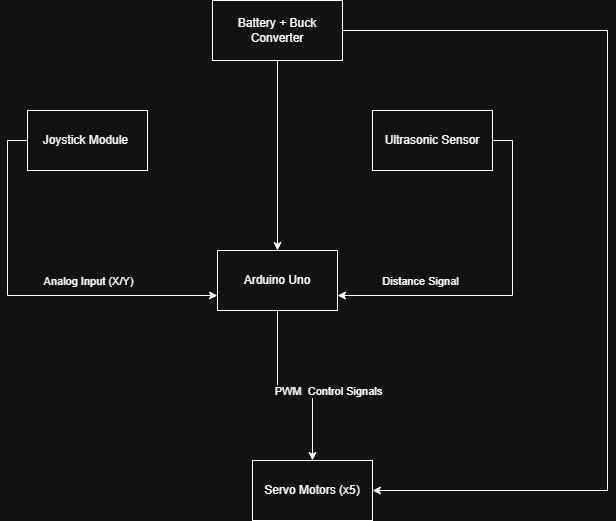

# Arduino Robotic Arm with Joystick and Ultrasonic Control

🚧 **Status:** Functional Prototype Completed – Ongoing Improvements

---

## Overview

This project is a 5-DOF robotic arm controlled using an Arduino Uno with both manual joystick input and automated ultrasonic sensing. The system demonstrates real-time servo control, sensor-based decision-making, and embedded hardware/software integration.

The goal of this project was to develop hands-on experience in embedded systems, actuator control, sensor integration, and real-world hardware debugging.

---

## Features

* 5-DOF robotic arm using servo motors
* Dual joystick input for manual control
* Ultrasonic sensor for object detection
* Automated pick-and-place sequence based on distance thresholds
* Real-time response to analog and digital inputs
* External power system for stable servo operation

---

## Hardware Used

* Arduino Uno (Elegoo R3)
* Sensor Shield V5
* 5x Servo Motors
* 2x Analog Joystick Modules
* HC-SR04 Ultrasonic Sensor
* External Battery Pack + Buck Converter
* Breadboard and jumper wires

---

## Pin Connections

### Servos

* Servo 1 (Base): Pin 9
* Servo 2 (Shoulder): Pin 6
* Servo 3 (Elbow): Pin 5
* Servo 4 (Wrist): Pin 3
* Servo 5 (Claw): Pin 11

### Joystick

* X-axis: A1
* Y-axis: A0
* Button: Pin 7

### Ultrasonic Sensor

* Trig: Pin 2
* Echo: Pin 4

---

## Code Structure

* `code/joystick_control.ino`
  → Handles real-time joystick input and maps analog values to servo movement

* `code/ultrasonic_pick_and_place.ino`
  → Uses HC-SR04 distance measurements to trigger automated movement sequences for object pickup and release

---

## How It Works

### Manual Mode

* Joystick inputs are read using `analogRead()`
* Threshold logic determines direction and motion
* Commands are mapped to servo positions

### Automatic Mode

* Ultrasonic sensor continuously measures distance
* When an object is within a defined threshold, a pick-and-place routine is executed
* Predefined servo sequences control grasping and placement

---

## Challenges and Fixes

### Servo Jitter

* **Cause:** Insufficient power from Arduino USB
* **Fix:** Implemented external battery + buck converter for stable power delivery

### False Joystick Movement

* **Cause:** Floating analog inputs when unconnected
* **Fix:** Correct wiring and threshold tuning

### Button Input Conflict

* **Cause:** Initial use of pin 0 (RX) interfered with serial communication
* **Fix:** Reassigned to a dedicated digital input pin

### Unstable Distance Triggering

* **Cause:** Ultrasonic sensor noise and fluctuating readings
* **Fix:** Adjusted thresholds and timing delays for reliable detection

---

## System Diagram

---

## Lessons Learned

* Proper power distribution is critical for multi-servo systems
* Floating analog inputs can produce false signals if not properly handled
* Hardware and software issues can appear similar and require systematic debugging
* Separating control logic into modules improves clarity and maintainability

---

## Future Improvements

* Custom PCB design using KiCad
* Fully 3D-printed robotic arm structure
* Inverse kinematics for smoother motion control
* Wireless control (Bluetooth/Wi-Fi integration)
* Mode switching between manual and automatic operation

---

## Author

Brandon Moran

Electronics Engineering Technology Student

Savannah State University

